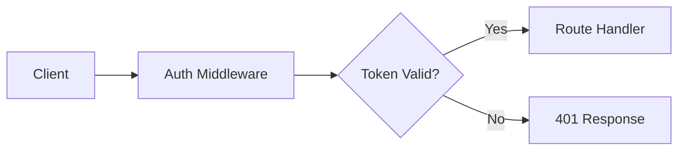

# Memory Protocol — Universal Rules

> **Always-on rule. ALL agents must follow this protocol without exception.**

This protocol maintains persistent project memory across sessions, ensuring continuity, traceability, and accumulated knowledge for the entire project lifecycle. Every agent in the framework references this rule on every interaction.

---

## 1. Memory Directory Structure

```
memory/
├── PROFILE.md          — Project DNA (identity, goals, stack, team, constraints)
├── CONTEXT.md          — Current state snapshot (~200 words, session bridge)
├── FACTS.md            — Verified facts knowledge base (accumulated, categorized)
├── DECISIONS.md        — Decision log with rationale (accumulated, numbered)
├── INSIGHTS.md         — Patterns, learnings, anti-patterns (accumulated)
├── SUMMARY.md          — Accumulated weekly summaries (all weeks)
├── weeks/              — Weekly partitioned temporal memory
│   └── YYYY-WNN/       — ISO week folders (e.g., 2026-W16)
│       ├── CHRONICLE.md — That week's event log
│       ├── SUMMARY.md   — Week summary (auto-generated at rotation)
│       └── YYYY-MM-DD/  — Daily work report folders
│           └── work-report-*.md
└── repo-wiki/          — Codebase documentation wiki
    ├── meta.json       — File index + aggregated tags (always loaded)
    └── *.md            — Wiki files (one per module/domain, flat structure)
```

All paths are relative to the workspace root.

---

## 2. Core Principles

### Principle 1 — Onboarding Gate

On **ANY** interaction, first check if `memory/PROFILE.md` exists.

- If it does **NOT** exist, invoke the **onboarding skill** BEFORE doing any other work.
- No exceptions. No partial work. Onboard first.

### Principle 2 — Weekly Rotation

On any interaction, determine the current ISO week in `YYYY-WNN` format.

If `memory/weeks/YYYY-WNN/` does **not** exist:

1. **Create** `memory/weeks/YYYY-WNN/CHRONICLE.md` with the header:
   ```
   # Chronicle — Week YYYY-WNN (Mon Date – Sun Date)
   ```
2. **Find** the most recent previous week folder in `memory/weeks/`.
3. **Read** that previous week's `CHRONICLE.md` and **generate** a `SUMMARY.md` inside that previous week's folder with these sections:
   - What was accomplished
   - Key decisions
   - Issues & blockers
   - New facts discovered
   - Insights
   - Metrics (chronicle entries count, decisions logged, facts recorded)
4. **Append** a condensed digest to `memory/SUMMARY.md` with:
   - Focus (main theme of the week)
   - Key outcomes
   - Decisions made (count)
   - Open issues
   - Next week priority
5. **Continue** working with the current week's `CHRONICLE.md`.

### Principle 3 — Read Before Act

On every task start, load relevant memory files:

| Priority | Files |
|----------|-------|
| **Always load** | `PROFILE.md`, `CONTEXT.md`, `repo-wiki/meta.json` |
| **Load when relevant** | `FACTS.md`, `DECISIONS.md`, current week's `CHRONICLE.md` |

Never begin substantive work without reading at minimum PROFILE.md and CONTEXT.md.

### Principle 4 — Record During Work

While working, agents must capture knowledge in real time:

- **New facts** → Add to `memory/FACTS.md` with category, source, and date.
- **Decisions made** → Add to `memory/DECISIONS.md` (numbered, with context/options/chosen/rationale/consequences) **AND** add a `[decision]` entry to the current week's `CHRONICLE.md`.
- **Significant events** → Add to the current week's `CHRONICLE.md` with an appropriate category tag.
- **Patterns noticed** → Add to `memory/INSIGHTS.md`.

### Principle 5 — Update After Work

At task completion:

- **Update** `memory/CONTEXT.md` if project state changed.
- **Update** `memory/PROFILE.md` if project understanding deepened (propose change to user first).

### Principle 6 — Never Contradict Without Logging

If new information contradicts existing memory, do **NOT** silently overwrite.

Log the change in `CHRONICLE.md` with:
- What changed
- Why it changed
- What the old value was

Then update the relevant memory file.

### Principle 7 — Memory Hygiene

Periodically (or on user request):

- **Consolidate** duplicate facts in `FACTS.md`.
- **Archive** resolved decisions in `DECISIONS.md` (mark as `Status: Superseded` with reference to the replacement decision).
- **Clean up** stale entries in `INSIGHTS.md`.
- **Ensure** `CONTEXT.md` is current and under ~200 words.

---

### Principle 8 — Repo Wiki Maintenance

The repo wiki (`memory/repo-wiki/`) is a living codebase documentation system. All agents must maintain it alongside code changes.

**After every code change**, assess whether repo-wiki needs updating:
1. Did a new file/module/component appear? → Add entry to the appropriate wiki file.
2. Did an existing module change significantly? → Update the corresponding wiki entry.
3. Is there a new tag-worthy concept? → Add tag to the wiki entry AND to `meta.json`.
4. Nothing meaningful changed? → Skip (do not create noise).

**Rules:**
- **One file per module/domain** — all wiki files are flat in `repo-wiki/` (no subfolders).
- **Priority: supplement** existing files. Create new files only for genuinely new topics.
- **Limit: 400 lines** per wiki file. If exceeded, split along logical boundaries.
- **Tags propagate up**: each entry in a wiki file has its own tags. The file's tags in `meta.json` are the **aggregated superset** of all entry tags in that file.
- **Mermaid diagrams** are encouraged for architecture, data flow, and dependency relationships.

---

## 3. Repo Wiki System

### Directory Structure

```
memory/repo-wiki/
├── meta.json       — File index + aggregated tags (always loaded into context)
├── overview.md     — Project architecture overview (mermaid diagram)
└── *.md            — One file per module/domain (flat, no subfolders)
```

### meta.json Schema

`meta.json` — обязательный файл. Каждый wiki-файл **должен** быть зарегистрирован в нём.

**Структура (обязательная):**

```json
{
  "files": {
    "<filename>.md": {
      "parent": "<parent-filename>.md",
      "sub": "<grandparent-filename>.md",
      "tags": ["tag1", "tag2"]
    }
  }
}
```

**Поля каждого файла:**

| Поле | Обязательное | Описание |
|------|-------------|----------|
| `tags` | ✅ Да | Массив агрегированных тегов всех entries в файле. Конкретные, не общие (например `jwt`, а не `security`) |
| `parent` | ❌ Нет | Имя родительского wiki-файла. Если отсутствует — файл корневой |
| `sub` | ❌ Нет | Имя «дедушки» — для вложенности 2-го уровня и глубже. Указывает на верхнего предка в цепочке |

**Правила иерархии:**

- Без `parent` → **корневой** файл (верхний уровень)
- `parent` → вложение 1-го уровня (виртуальная подпапка)
- `parent` + `sub` → вложение 2-го уровня (`sub` = дедушка)
- Более глубокая вложенность — через цепочку `sub` к верхнему предку

**Пример:**

```json
{
  "files": {
    "overview.md": {
      "tags": ["system-diagram", "entry-point", "tech-stack"]
    },
    "module-auth.md": {
      "parent": "overview.md",
      "tags": ["jwt", "oauth2", "session", "refresh-token", "rbac"]
    },
    "module-auth-passport.md": {
      "parent": "module-auth.md",
      "sub": "overview.md",
      "tags": ["passport", "strategies", "serialize"]
    },
    "infra.md": {
      "tags": ["docker", "nginx", "postgres", "redis", "ci-pipeline"]
    }
  }
}
```

**Виртуальное дерево (из примера выше):**

```
overview.md                          ← root
├── module-auth.md                   ← parent: overview.md
│   └── module-auth-passport.md      ← parent: module-auth.md, sub: overview.md
infra.md                             ← root
└── infra-ci.md                      ← parent: infra.md
```

- Tags в `meta.json` = **супермножество** всех тегов всех entries в файле
- Новый тег в entry → добавить в `meta.json` для этого файла
- `meta.json` **всегда** загружается в контекст агента (см. Principle 3)

### Wiki File Format

Each wiki file contains multiple **entries** (one per logical component/feature within the module). Each entry follows this structure:

```markdown
## Entry: [Component/Feature Name]
> Tags: tag1, tag2, tag3

### Overview
[What this is and why it exists — brief description]

### Key Files
| File | Lines | Description |
|------|-------|-------------|
| `src/auth/jwt.ts` | 1-45 | JWT token generation and validation |
| `src/auth/middleware.ts` | 23-67 | Express auth middleware |

### Architecture
[Mermaid diagram if the component has internal structure or external dependencies]



### Dependencies
[What this component depends on and what depends on it]

### Important Details
[Non-obvious decisions, edge cases, critical line references]
```

### Wiki File Header

Each wiki file starts with YAML frontmatter:

```markdown
---
title: Module/Domain Name
description: Brief module description
---

[entries follow below]
```

- `description` — краткое описание модуля. Используется для быстрого понимания содержимого файла.
- Frontmatter может быть расширен в будущем дополнительными полями при необходимости.

### When to Update Repo Wiki

| Event | Action |
|-------|--------|
| New file created in codebase | Add entry to the appropriate wiki file |
| Existing file significantly changed | Update the corresponding entry |
| New module/domain introduced | Create new wiki file + add to `meta.json` |
| New concept/tag emerges | Add tag to entry AND to `meta.json` |
| File deleted or moved | Update or remove the corresponding entry |
| No meaningful change | Skip — do not create noise |

---

## 4. Agent Memory Responsibilities

| Agent | Reads on Start | Records During Work | Updates After |
|-------|---------------|--------------------|--------------| 
| **arhitect** | All memory files | Decisions, milestones, architecture facts | CONTEXT, PROFILE, CHRONICLE |
| **coder** | PROFILE, CONTEXT, FACTS | Technical facts, implementation patterns | FACTS, CHRONICLE, agent memory |
| **review** | PROFILE, CONTEXT, FACTS, DECISIONS | Quality insights, recurring issues | INSIGHTS, CHRONICLE |
| **debug** | All memory files | Root causes, investigation findings | FACTS, CHRONICLE, INSIGHTS |
| **ask** | All memory files | Nothing (read-only agent) | — |
| **consilium** | PROFILE, FACTS, DECISIONS, INSIGHTS | Strategic decisions, business insights | DECISIONS, INSIGHTS, CHRONICLE |
| **devops** | PROFILE, CONTEXT, FACTS | Infrastructure facts, deployment patterns | FACTS, CHRONICLE, agent memory |

---

## 5. Memory File Schemas

### PROFILE.md

```markdown
# Project Profile

## Identity
- **Name**: Project name
- **Type**: Application type (web app, CLI tool, library, etc.)
- **Description**: One-paragraph summary
- **Started**: YYYY-MM-DD

## Goals
- **Primary**: The main objective
- **Secondary**: Supporting objectives

## Stack & Tools
- Languages, frameworks, databases, infrastructure, dev tools

## Team & Roles
- Who is involved and their responsibilities

## Constraints
- Budget, timeline, technical, regulatory, or other limitations

## Communication
- **Language**: Project language (e.g., English)
- **Style**: Communication preferences

## Custom Framework Config
- **Active Agents**: Which agents are enabled
- **Custom Rules**: Any project-specific rule overrides
- **Custom Skills**: Any project-specific skills
```

### CONTEXT.md

```markdown
# Current Context (updated: YYYY-MM-DD)

## State
- **Working on**: Current focus
- **Last completed**: Most recent completed task
- **Blocked by**: Current blockers (if any)

## Active Tasks
- Bullet list of in-progress work

## Recent Decisions
- References to latest decisions (e.g., see DECISIONS.md#NNN)

## Watch Out
- Active risks, constraints, or things to remember
```

Max ~200 words. Updated at session boundaries or when project state changes.

### FACTS.md

```markdown
# Project Facts

## Technical
- Fact description [source: where learned, date: YYYY-MM-DD]

## Business
- Fact description [source: where learned, date: YYYY-MM-DD]

## Constraints
- Fact description [source: where learned, date: YYYY-MM-DD]

## People
- Fact description [source: where learned, date: YYYY-MM-DD]

## [Additional categories as needed]
```

### DECISIONS.md

```markdown
# Decisions

## #001 — Decision Title (YYYY-MM-DD)
**Context**: Why this decision was needed
**Options**: What alternatives were considered
**Chosen**: What was selected and why
**Consequences**: What follows from this decision
**Status**: Active | Superseded by #NNN | Reversed
```

Decisions are numbered sequentially. Never reuse a decision number.

### INSIGHTS.md

```markdown
# Insights

## What Works
- Patterns and approaches that succeeded

## What Doesn't Work
- Anti-patterns discovered (with context on why they failed)

## Patterns
- Recurring observations about the project, team, or process
```

### CHRONICLE.md (per week)

```markdown
# Chronicle — Week YYYY-WNN (Mon Date – Sun Date)

## YYYY-MM-DD

### [category] Title
Description or context of the event.
Ref: DECISIONS.md#NNN (optional cross-reference)
```

**Valid categories**: `[decision]`, `[milestone]`, `[issue]`, `[discovery]`, `[change]`, `[insight]`

### SUMMARY.md (accumulated, root level)

```markdown
# Project Weekly Summaries

## Week YYYY-WNN (Mon Date – Sun Date)
**Focus**: Main theme of the week
**Key outcomes**: Bullet list of what was achieved
**Decisions made**: Count
**Open issues**: Bullet list of unresolved items
**Next week priority**: What comes next
```

Each week's digest is appended chronologically. Newest week at the bottom.

### Per-Week SUMMARY.md (inside `weeks/YYYY-WNN/`)

```markdown
# Week Summary — YYYY-WNN (Mon Date – Sun Date)

## What was accomplished
## Key decisions
## Issues & blockers
## New facts discovered
## Insights
## Metrics
- Chronicle entries: N
- Decisions logged: N
- Facts recorded: N
```

---

## 6. What to Record vs. What to Skip

### RECORD

- Verified facts (technical, business, constraints)
- Decisions with rationale
- Architecture changes
- Discovered constraints
- User preferences and communication style
- Recurring patterns (positive and negative)
- Significant milestones
- Blockers and their resolutions
- New tool, API, or library learnings

### SKIP

- Trivial implementation details (typo fixes, formatting changes)
- Temporary debug output
- Speculative ideas not yet validated
- Session-specific ephemera (intermediate thoughts, scratchpad)
- Intermediate failed attempts (record only the final resolution)

---

## 7. Work Report Discipline

Every completed task **must** produce a work report saved as a markdown file.

### Format:

- **Location:** `memory/weeks/YYYY-WNN/YYYY-MM-DD/` (inside current ISO week folder, e.g. `memory/weeks/2026-W16/2026-04-19/`)
- **Filename:** `work-report-<short-slug>.md` (e.g. `work-report-502-fix.md`, `work-report-add-search-api.md`)
- **Content:** The same completion summary that is sent via `attempt_completion`, but formatted as a standalone document with full context

### Required sections:

```markdown
# Work Report: [Title]
*Date: YYYY-MM-DD*
*Mode: [which modes were used]*
*Status: ✅ Complete / ⚠️ Partial*

## Problem
[What was the task / issue]

## Root Cause (if investigation)
[What was found]

## What Was Done
[Numbered list of all actions taken]

## Changed Files
[Table: File | Action | Description]

## Lessons Learned (optional)
[Key takeaways for future reference]
```

### Rules:

- The work report file **must be created BEFORE** calling `attempt_completion`
- The `attempt_completion` message should reference the report: `memory/weeks/YYYY-WNN/YYYY-MM-DD/work-report-*.md`
- If multiple tasks are completed on the same date, each gets its own report file in the same folder
- ALL modes (@coder, @coder-expert, @meta-architect) must follow this rule when producing final output
- **Repo Wiki check:** After writing the work report and before calling `attempt_completion`, assess whether any code changes require updates to `memory/repo-wiki/`. If yes — update the relevant wiki files and `meta.json`.

---

## 8. Cross-Reference Convention

When recording events that relate to other memory files, use references:

- `Ref: DECISIONS.md#NNN` — reference to a specific decision number
- `Ref: FACTS.md/Technical` — reference to a facts category
- `Added to FACTS.md` — note when a fact was also recorded in another file
- `See INSIGHTS.md/What Works` — reference to an insights section

Cross-references maintain traceability between memory files. Use them whenever an entry in one file relates to content in another.
