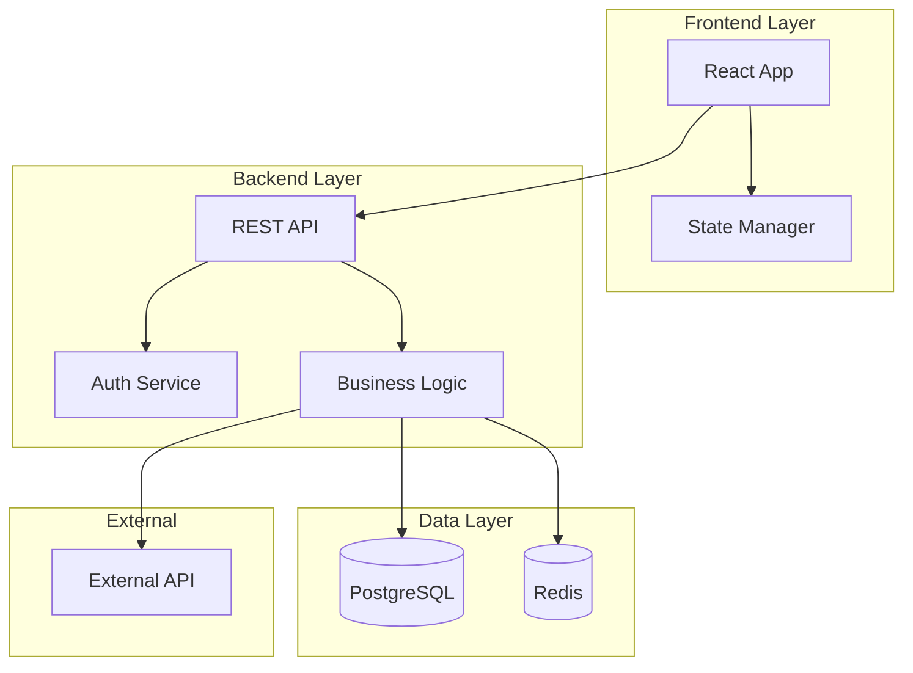
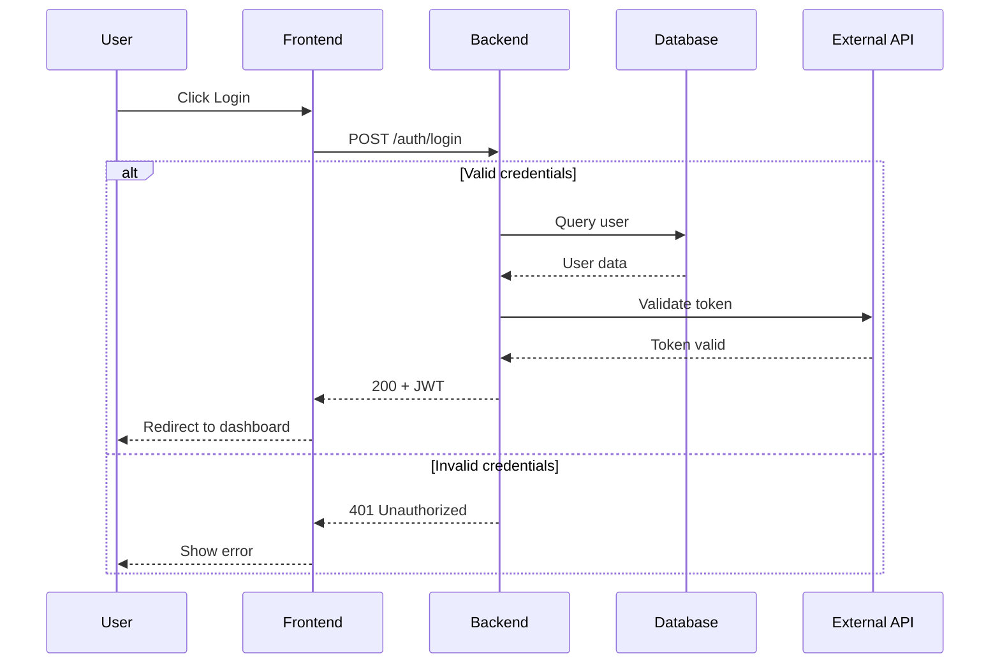
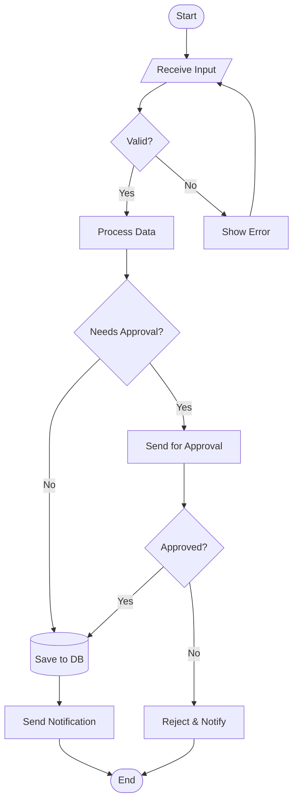
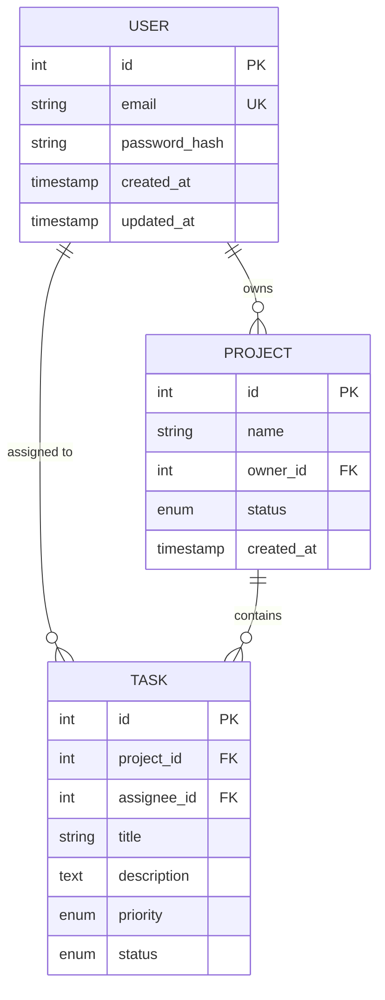
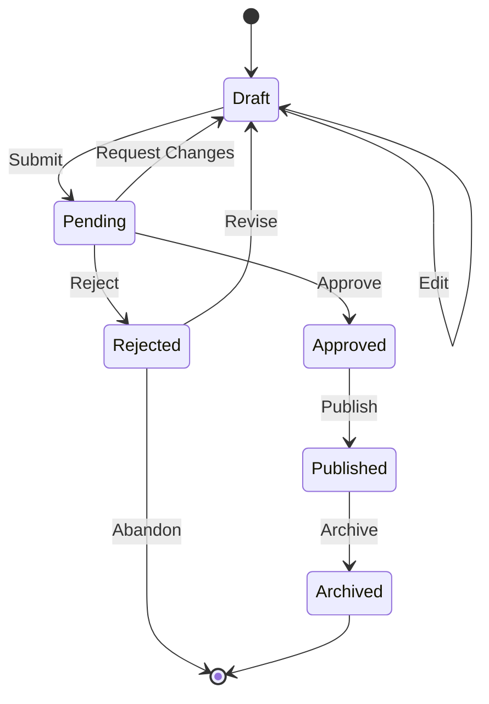
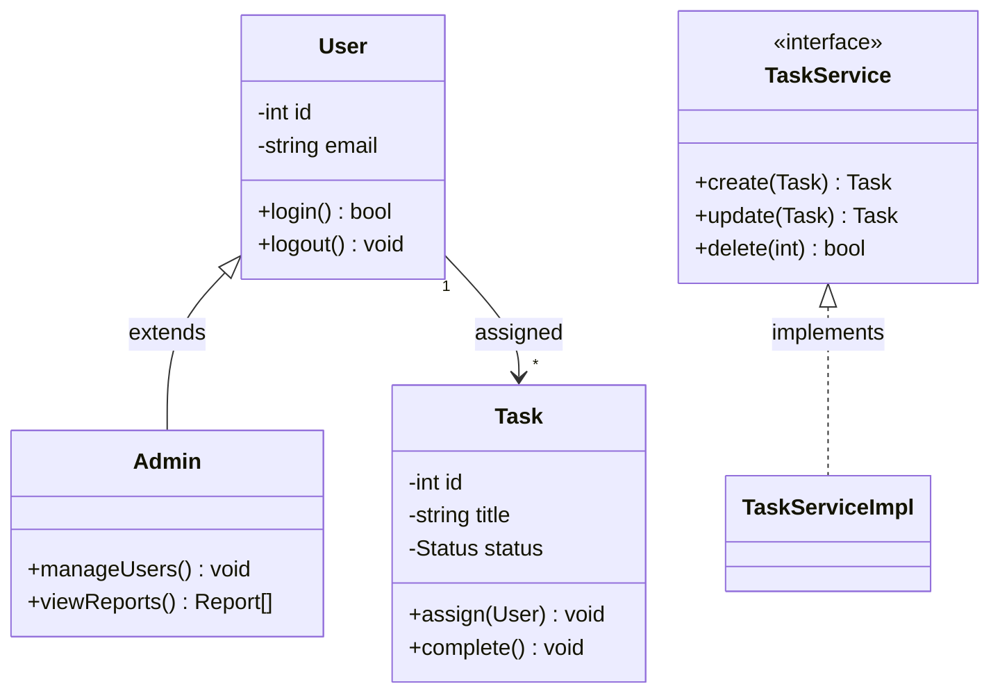

# 📊 Mermaid Diagrams Guide

<purpose>
Руководство по выбору и созданию Mermaid-диаграмм для архитектурной документации.
Один аспект системы = одна диаграмма.
</purpose>

---

## Типы Диаграмм и Когда Использовать

| Тип | Синтаксис | Когда Использовать |
|-----|-----------|-------------------|
| **Architecture** | `graph TB/LR` | Слои системы, компоненты, зависимости |
| **Sequence** | `sequenceDiagram` | Временные последовательности, API вызовы |
| **Flowchart** | `flowchart TD` | Бизнес-процессы с ветвлениями |
| **ER Diagram** | `erDiagram` | Схема базы данных, связи таблиц |
| **State** | `stateDiagram-v2` | Состояния объекта, FSM |
| **Class** | `classDiagram` | Структура классов, наследование |

---

## 1. Architecture Diagram (graph)

> **Назначение:** Визуализация слоёв системы и их компонентов.

### Когда использовать
- Обзор архитектуры системы
- Показать слои (Frontend, Backend, Data)
- Связи между сервисами/модулями
- Внешние зависимости

### Вопросы для создания
- Какие основные слои системы?
- Какие компоненты в каждом слое?
- Как слои взаимодействуют?
- Какие внешние зависимости?

### Шаблон



### Формы узлов

| Синтаксис | Форма | Использование |
|-----------|-------|---------------|
| `A[Text]` | Прямоугольник | Компонент, сервис |
| `A([Text])` | Скруглённый | Процесс, action |
| `A[(Text)]` | Цилиндр | База данных |
| `A{Text}` | Ромб | Решение, условие |
| `A{{Text}}` | Hexagon | Подготовка |
| `A>Text]` | Флаг | Асинхронный сигнал |

---

## 2. Sequence Diagram

> **Назначение:** Временная последовательность взаимодействий.

### Когда использовать
- API flows (request → response)
- User journey через систему
- Интеграции между сервисами
- Async workflows

### Вопросы для создания
- Кто участники взаимодействия?
- Какая последовательность действий?
- Есть ли асинхронные операции?
- Какие альтернативные пути (alt/else)?
- Какие данные передаются?

### Шаблон



### Типы стрелок

| Синтаксис | Значение |
|-----------|----------|
| `->>` | Синхронный запрос |
| `-->>` | Синхронный ответ |
| `--)` | Асинхронный |
| `--x` | Потерянное сообщение |

---

## 3. Flowchart

> **Назначение:** Бизнес-процессы с логикой и ветвлениями.

### Когда использовать
- Бизнес-процесс от начала до конца
- Алгоритм с условиями
- Обработка данных с ветвлением
- Workflow с несколькими путями

### Вопросы для создания
- Какая точка входа и выхода?
- Какие условия влияют на ход процесса?
- Какие данные трансформируются?
- Какие шаги параллельны?

### Шаблон



### Формы узлов для Flowchart

| Синтаксис | Форма | Использование |
|-----------|-------|---------------|
| `([Text])` | Stadium | Start/End |
| `[Text]` | Rectangle | Process |
| `{Text}` | Diamond | Decision |
| `[/Text/]` | Parallelogram | Input/Output |
| `[(Text)]` | Cylinder | Database |

---

## 4. ER Diagram

> **Назначение:** Схема базы данных с таблицами и связями.

### Когда использовать
- Проектирование БД
- Документация существующей схемы
- Показать связи между таблицами
- Обзор data model

### Вопросы для создания
- Какие основные сущности?
- Какие атрибуты у каждой?
- Какие типы данных?
- Какие ключи (PK, FK, UK)?
- Какие связи (1:1, 1:N, N:M)?

### Шаблон



### Типы связей

| Синтаксис | Связь |
|-----------|-------|
| `\|\|--\|\|` | One-to-One |
| `\|\|--o{` | One-to-Many |
| `}o--o{` | Many-to-Many |
| `\|\|--o\|` | One-to-Zero/One |

---

## 5. State Diagram

> **Назначение:** Состояния объекта и переходы между ними.

### Когда использовать
- Жизненный цикл объекта
- Finite State Machine
- Workflow статусов
- UI component states

### Шаблон



---

## 6. Class Diagram

> **Назначение:** Структура классов и их отношения.

### Когда использовать
- OOP архитектура
- Наследование и композиция
- Interfaces и implementations
- Domain model

### Шаблон



---

## Best Practices

### DO ✅

- Один аспект = одна диаграмма
- Использовать `subgraph` для группировки
- Давать осмысленные имена узлам
- Добавлять краткое описание под диаграммой
- Использовать направление `TB` для иерархий, `LR` для потоков

### DON'T ❌

- Перегружать одну диаграмму всем
- Использовать длинные тексты в узлах
- Смешивать разные уровни абстракции
- Забывать про легенду/описание
- Создавать диаграмму ради диаграммы

---

## Quick Reference

```
ARCHITECTURE:   graph TB/LR + subgraph
SEQUENCE:       sequenceDiagram + participant + ->>
FLOWCHART:      flowchart TD + {decision} + -->|label|
ER:             erDiagram + ||--o{ + attributes
STATE:          stateDiagram-v2 + [*] + -->
CLASS:          classDiagram + <<interface>> + <|--
```

---

## Связанные Файлы

- `templates/architecture.md` — шаблон Architecture.md
- `templates/research.md` — для визуализации исследований
- `guides/decomposition.md` — декомпозиция с диаграммами

---

**END OF GUIDE**
