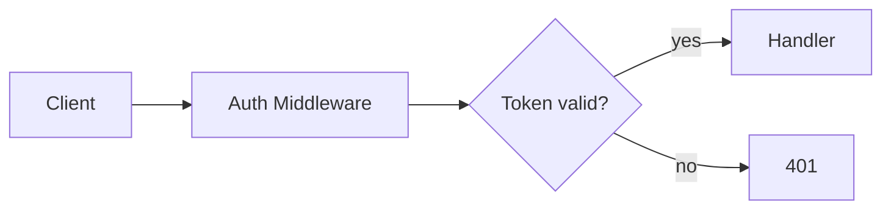

# Memory Keeping

Formats for everything under `memory/`. The *when* and *why* live in `rules/memory-protocol.md`; this is the *how*, loaded when you are about to write.

## Layout

```
memory/
├── PROFILE.md          — project DNA; changes rarely
├── CONTEXT.md          — current state, ~200 words; changes every session
├── FACTS.md            — verified facts, accumulated, categorised
├── DECISIONS.md        — numbered decision log with rationale
├── INSIGHTS.md         — patterns, learnings, anti-patterns
├── SUMMARY.md          — accumulated weekly digests
├── adrs/               — ADR-NNN.md, architectural decisions
├── weeks/YYYY-WNN/
│   ├── CHRONICLE.md    — that week's event log
│   ├── SUMMARY.md      — written at rotation
│   └── YYYY-MM-DD/     — work reports for that day
└── repo-wiki/
    ├── meta.json       — file index + aggregated tags; always loaded
    └── *.md            — one file per module or domain, flat
```

## Core files

### PROFILE.md

```markdown
# Project Profile

## Identity
- **Name**, **Type**, **Description** (one paragraph), **Started**: YYYY-MM-DD

## Goals
- **Primary**: the main objective
- **Secondary**: supporting objectives

## Stack & Tools
Languages, frameworks, databases, infrastructure, dev tools

## Team & Roles
Who is involved, and what each is responsible for

## Constraints
Budget, timeline, technical, regulatory

## Communication
- **Language**, **Style**

## Framework Config
Active agents, rule overrides, project-specific skills
```

### CONTEXT.md

```markdown
# Current Context (updated: YYYY-MM-DD)

## State
- **Working on**: current focus
- **Last completed**: most recent finished task
- **Blocked by**: current blockers

## Active Tasks
## Recent Decisions
See DECISIONS.md#NNN

## Watch Out
Live risks and constraints
```

Keep it under ~200 words. It is the session bridge, not an archive — when it grows, the excess belongs in FACTS, DECISIONS, or the chronicle.

### FACTS.md

Grouped by category (Technical, Business, Constraints, People, and any the project needs):

```markdown
- Fact description [source: where learned, date: YYYY-MM-DD]
```

Every fact carries where it came from. An unsourced fact cannot be re-verified when it later turns out wrong.

### DECISIONS.md

```markdown
## #001 — Title (YYYY-MM-DD)
**Context**: why the decision was needed
**Options**: alternatives considered
**Chosen**: what was selected, and why
**Consequences**: what follows
**Status**: Active | Superseded by #NNN | Reversed
```

Numbered sequentially. A number is never reused — superseding creates a new entry pointing back.

A decision that reshapes the system and is expensive to reverse earns an ADR in `memory/adrs/` as well: format in `workflow-architecture-change/references/adr-template.md`. The `DECISIONS.md` entry then points at it rather than repeating it.

### INSIGHTS.md

Three sections: **What Works**, **What Doesn't Work** (with the context that made it fail), **Patterns**.

### CHRONICLE.md

```markdown
# Chronicle — Week YYYY-WNN (Mon DD – Sun DD)

## YYYY-MM-DD

### [category] Title
What happened, and what it means.
Ref: DECISIONS.md#NNN
```

Categories: `[decision]`, `[milestone]`, `[issue]`, `[discovery]`, `[change]`, `[insight]`.

### SUMMARY.md

Root file, one digest per week, appended chronologically:

```markdown
## Week YYYY-WNN (Mon DD – Sun DD)
**Focus**: the week's theme
**Key outcomes**: what was achieved
**Decisions made**: count
**Open issues**: unresolved
**Next week priority**: what comes next
```

The per-week `weeks/YYYY-WNN/SUMMARY.md` is fuller: what was accomplished, key decisions, issues and blockers, new facts, insights, and metrics (chronicle entries, decisions logged, facts recorded).

## Repo wiki

Living documentation of the codebase. One file per module or domain, flat — no subfolders. Hierarchy is expressed in `meta.json`, not in the filesystem.

### glossary.md — the project's language

`repo-wiki/glossary.md` holds the domain terms, registered in `meta.json` like any other wiki file. It lives here because it grows: `PROFILE.md` changes rarely and `CONTEXT.md` is capped at ~200 words, so neither can hold a list that gains an entry every time a decision names something.

One entry per term, and the third line is the one that does the work — a term with no confusable neighbour rarely needed writing down:

```markdown
## Tenant
An organisation with its own isolated data. Billing attaches here, not to User.
_Not_: Workspace (a UI grouping inside a tenant), Account (the billing record).
```

Write a term the moment it is resolved or sharpened, not in a pass at the end — the confusion a glossary prevents happens in the days before anyone would think to batch it. When code renames a concept, the entry changes in the same task.

### meta.json

Every wiki file must be registered here. It is loaded into context on every task, so its tags are the index the agent navigates by.

```json
{
  "files": {
    "overview.md":            { "tags": ["system-diagram", "entry-point", "tech-stack"] },
    "module-auth.md":         { "parent": "overview.md",
                                "tags": ["jwt", "oauth2", "session", "rbac"] },
    "module-auth-passport.md":{ "parent": "module-auth.md", "sub": "overview.md",
                                "tags": ["passport", "strategies", "serialize"] }
  }
}
```

| Field | Required | Meaning |
|---|---|---|
| `tags` | yes | Superset of all entry tags in the file. Specific over general — `jwt`, not `security` |
| `parent` | no | Parent wiki file. Absent means a root file |
| `sub` | no | The grandparent, for nesting two levels deep and beyond |

When an entry gains a new tag, add it to the file's `meta.json` tags as well — an unregistered tag is unreachable.

### Wiki file format

````markdown
---
title: Module Name
description: One line — what this module is
---

## Entry: [Component or Feature]
> Tags: tag1, tag2

### Overview
What this is and why it exists.

### Key Files
| File | Lines | Description |
|---|---|---|
| `src/auth/jwt.ts` | 1-45 | Token generation and validation |

### Architecture


### Dependencies
What it depends on, and what depends on it.

### Important Details
Non-obvious decisions, edge cases, critical line references.
````

Cap each wiki file at 400 lines; past that, split along a logical boundary and register both halves. Prefer supplementing an existing file to creating a new one — a new file is for a genuinely new topic.

### When to update it

| Event | Action |
|---|---|
| New module or domain | New wiki file + `meta.json` entry |
| New file in an existing module | Add an entry to that module's file |
| Significant change to existing code | Update the matching entry |
| New concept worth finding by | Add the tag to the entry **and** `meta.json` |
| File deleted or moved | Update or remove the entry |
| Nothing meaningful changed | Skip — noise costs more than the gap |

## Work reports

Every completed 🟡 or 🔴 task produces one, written **before** the completion message, which then references it. 🟢 work closes with a `CHRONICLE.md` line, or with nothing when it taught nothing.

**Path:** `memory/weeks/YYYY-WNN/YYYY-MM-DD/work-report-<slug>.md`

```markdown
# Work Report: [Title]
*Date: YYYY-MM-DD*
*Agents: [which ran]*
*Status: ✅ Complete | ⚠️ Partial*

## Problem
## Root Cause
(for investigations)
## What Was Done
1. …
## Changed Files
| File | Action | Description |
|---|---|---|
## Lessons Learned
(optional)
```

One report per task, even when several land the same day.

## Cross-references

Link entries rather than restating them: `Ref: DECISIONS.md#NNN`, `Ref: FACTS.md/Technical`, `See INSIGHTS.md/What Works`. A fact copied into three files drifts into three versions.

## Completion criterion

A memory write is done when: every fact carries a source and a date, every decision carries context and consequences, `CONTEXT.md` is under ~200 words and reflects the state a fresh session would need, and any new wiki entry is registered in `meta.json` with its tags.
