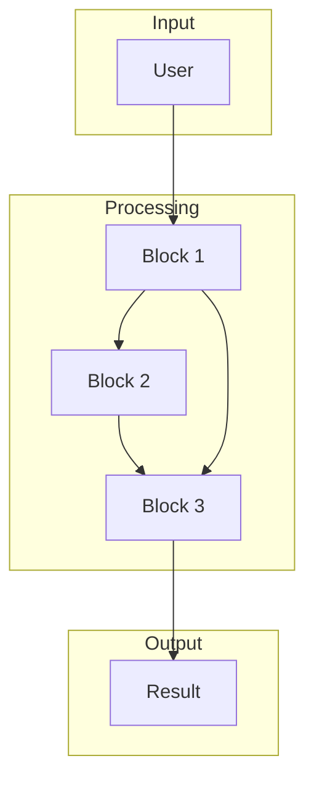
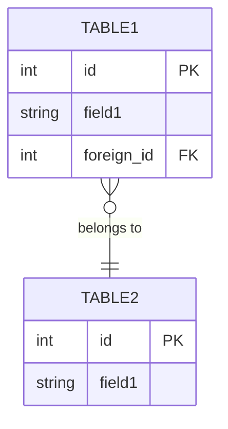

# 🧱 System Blocks Template

<purpose>
Шаблон модульной декомпозиции системы на функциональные блоки.
Используется для структурированного описания сложных систем.
</purpose>

---

> **Инструкция:** Заполни секции ниже, адаптируя под количество блоков.
> Каждый блок описывается по единому шаблону.

---

## Общая Концепция

### Краткое Описание
> [1-2 предложения: что представляет собой система и какую проблему решает]

### Количество Блоков
Система состоит из **[N]** основных функциональных блоков.

### Технологический Стек

| Категория | Технологии |
|-----------|------------|
| **Frontend** | [React, Vue, etc.] |
| **Backend** | [Node.js, Python, etc.] |
| **Database** | [PostgreSQL, MongoDB, etc.] |
| **Cache** | [Redis, Memcached, etc.] |
| **Queue** | [RabbitMQ, Bull, etc.] |
| **Storage** | [S3, MinIO, etc.] |
| **Auth** | [JWT, OAuth2, etc.] |
| **Real-time** | [WebSocket, SSE, etc.] |
| **API Integrations** | [External services] |

---

## 📦 БЛОК 1: [Название Блока]

### Назначение

**Вопросы для определения:**
- Какую основную бизнес-задачу решает этот блок?
- Почему он необходим в системе?

> [Описание назначения блока]

---

### Функциональность

**Вопросы для определения:**
- Какие основные функции реализует?
- Есть ли альтернативные режимы работы?
- Какие входные данные требуются?
- Какие выходные данные генерируются?

#### Режим 1.1: [Название режима]

**Принцип работы:**
1. [Шаг 1]
2. [Шаг 2]
3. [Шаг 3]

**Входные данные:**
- [Input 1]: [тип, источник]
- [Input 2]: [тип, источник]

**Выходные данные:**
- [Output 1]: [формат]

#### Режим 1.2: [Название режима] (если есть)

[Аналогичная структура]

---

### Компоненты

**Вопросы для определения:**
- Какие программные компоненты/классы/сервисы нужны?
- Какую ответственность несёт каждый компонент?

| Компонент | Ответственность |
|-----------|-----------------|
| `ComponentName` | [Описание] |
| `ServiceName` | [Описание] |
| `RepositoryName` | [Описание] |

---

### Интерфейсы (UI)

**Вопросы для определения:**
- Какие UI-элементы нужны пользователю?
- Какие экраны/формы/виджеты требуются?

- [ ] [UI элемент 1]
- [ ] [UI элемент 2]
- [ ] [UI элемент 3]

---

### API Endpoints

| Method | Endpoint | Описание |
|--------|----------|----------|
| GET | `/api/[resource]` | [Что возвращает] |
| POST | `/api/[resource]` | [Что создаёт] |
| PUT | `/api/[resource]/:id` | [Что обновляет] |
| DELETE | `/api/[resource]/:id` | [Что удаляет] |

---

### Результат / Выходные Данные

**Вопросы для определения:**
- Что получает пользователь на выходе?
- В каком формате представлены данные?

> [Описание результата блока]

---

## 📦 БЛОК 2: [Название Блока]

[Повторить структуру Блока 1]

---

## 📦 БЛОК 3: [Название Блока]

[Повторить структуру Блока 1]

---

## 🔗 Взаимосвязи Блоков

### Поток Данных



### Дерево Зависимостей

```
BLOCK 3
├── BLOCK 2
│   └── BLOCK 1 (базовый)
└── BLOCK 1 (базовый)
```

---

## 📊 Приоритеты Разработки

| # | Блок | Приоритет | Обоснование |
|---|------|-----------|-------------|
| 1 | [Block 1] | 🔴 КРИТИЧНО | [Почему] |
| 2 | [Block 2] | 🟡 ВЫСОКИЙ | [Почему] |
| 3 | [Block 3] | 🟡 ВЫСОКИЙ | [Почему] |
| 4 | [Block 4] | 🟢 СРЕДНИЙ | [Почему] |
| 5 | [Block 5] | ⚪ НИЗКИЙ | [Почему] |

### Визуализация Приоритетов

```
🔴 КРИТИЧНО  ████████████████████  BLOCK 1
🟡 ВЫСОКИЙ   ██████████████        BLOCK 2, BLOCK 3
🟢 СРЕДНИЙ   █████████             BLOCK 4
⚪ НИЗКИЙ    █████                 BLOCK 5
```

---

## 💾 Схема Базы Данных



---

## ⚠️ Риски и Зависимости

### Критические Зависимости

| Зависимость | Блок | Критичность | Митигация |
|-------------|------|-------------|-----------|
| [External API] | Block 2 | 🔴 HIGH | [План B] |
| [Third-party lib] | Block 3 | 🟡 MEDIUM | [Альтернатива] |

### Технические Риски

| Риск | Влияние | Вероятность | Митигация |
|------|---------|-------------|-----------|
| [Risk 1] | High | Medium | [Action] |
| [Risk 2] | Medium | Low | [Action] |

---

## 📋 Ключевые Вопросы для Интервью

### Стратегические
1. Какую основную бизнес-проблему решает система?
2. Кто целевые пользователи?
3. На сколько логических блоков можно разбить систему?
4. Какие внешние интеграции критичны?

### Для Каждого Блока
5. Какое **назначение** этого блока?
6. Какую **функциональность** он предоставляет?
7. Есть ли **альтернативные режимы** работы?
8. Какие **компоненты** нужны для реализации?
9. Какие **UI-элементы** требуются?
10. Какой **поток данных** (вход/выход)?

### Архитектурные
11. Как блоки **взаимодействуют** между собой?
12. Какие **зависимости** между блоками?
13. Какой **приоритет** разработки каждого блока?
14. Какие **API endpoints** нужны?
15. Какая **схема БД** требуется?

### Технологические
16. Какой **технологический стек** оптимален?
17. Какие **внешние API** будут использоваться?
18. Нужны ли **очереди** для фоновых задач?
19. Как организовать **хранение файлов**?
20. Какие **real-time** возможности нужны?

---

## История Версий

| Версия | Дата | Автор | Изменения |
|--------|------|-------|-----------|
| 1.0 | YYYY-MM-DD | `architect` | Initial decomposition |

---

## Связанные Документы

- `Architecture.md` — архитектурные решения
- `Requirements.md` — детальные требования
- `Plan.md` — план реализации
- `adr/*.md` — Architecture Decision Records

---

**END OF TEMPLATE**
